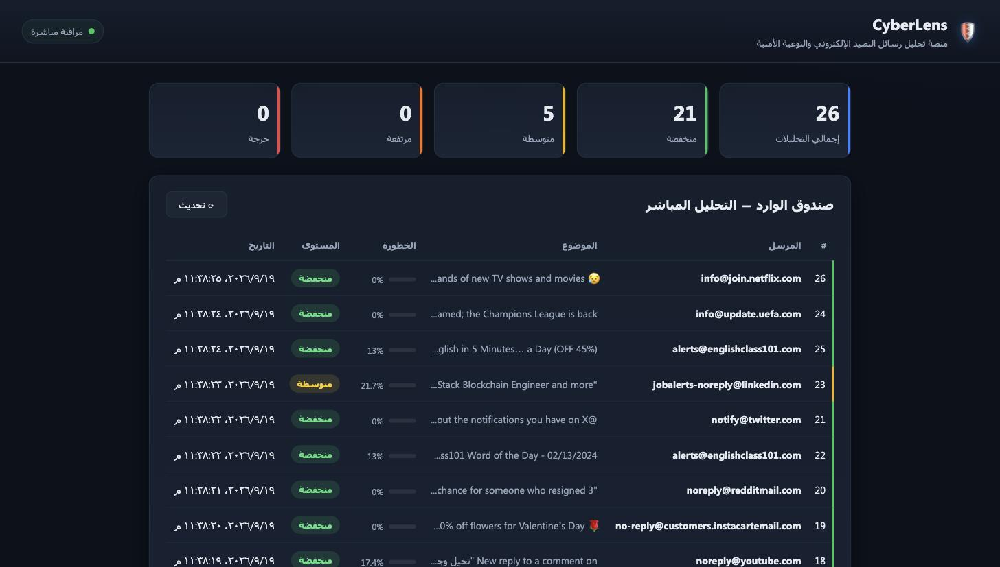
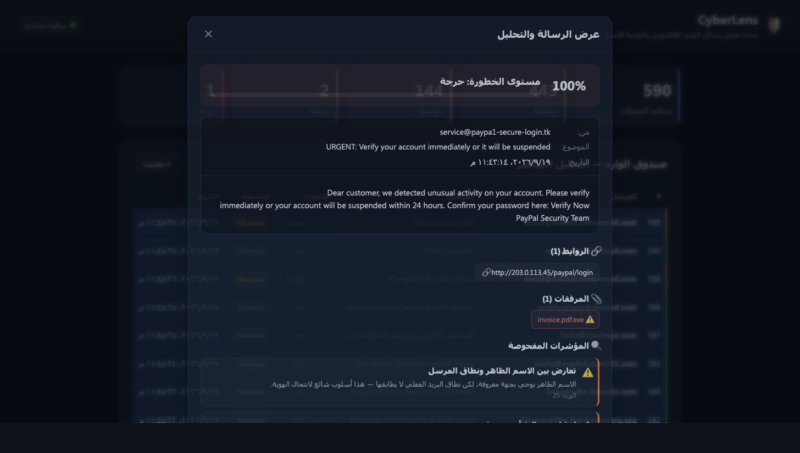

<div dir="rtl">

# 🛡️ CyberLens

**منصة ذكية لتحليل رسائل التصيد الإلكتروني (Phishing) والتوعية الأمنية.**

CyberLens يفحص رسائل البريد الإلكتروني ويكشف مؤشرات التصيّد، يحسب درجة خطورة، ويقدّم توصيات توعوية — كل ذلك عبر تحليل نصي/بنيوي آمن **دون فتح أو تشغيل أي رابط أو مرفق فعليًا**.

يعمل بطريقتين:

1. **تلقائي عبر بوابة البريد (IMAP Gateway):** يتصل الـ backend بصندوق بريد، يسحب كل رسالة واردة، يحلّلها تلقائيًا، ويعرض درجة خطرها في لوحة التحكم مباشرة — دون أي إدخال يدوي.
2. **يدوي عبر الـ API:** إرسال رسالة خام (`.eml` / RFC822) إلى `/api/analyze/raw`، أو حقول منظّمة إلى `/api/analyze`.

---

## 📸 لقطات

### لوحة التحكم — التحليل المباشر


### عرض الرسالة الكامل والتحليل


---

## ✨ المزايا

- **بوابة بريد تلقائية** تفحص الوارد عبر IMAP دون تدخّل المستخدم.
- **محرّك كشف بخمس قواعد** بأوزان قابلة للتعديل.
- **درجة خطورة** (0–100%) وتصنيف: منخفضة / متوسطة / مرتفعة / حرجة.
- **توصيات توعوية** مرتبطة بالمؤشرات المُفعّلة فعليًا.
- **لوحة تحكم حيّة** تتحدّث تلقائيًا وتُبرز الرسائل الواردة الجديدة.
- **عارض رسالة كامل** يعرض الظرف والنص والروابط والمرفقات وكل المؤشرات.
- **يعمل بالكامل عبر Docker** بأمر واحد.

---

## 🏗️ البنية

```
        ┌────────────────────────┐        ┌──────────────────────┐
        │   حاوية Backend        │        │   حاوية Frontend     │
        │   FastAPI + SQLite     │◄──────►│   Nginx (لوحة تحكم)  │
        │                        │  HTTP  │   HTML/CSS/JS        │
        │  ┌──────────────────┐  │        └──────────────────────┘
IMAP ──►│  │ بوابة البريد     │  │                 ▲
صندوق   │  │ (خيط خلفي)       │  │                 │ المنفذ 8081
الوارد  │  └────────┬─────────┘  │                 │
        │           ▼            │        ┌──────────────────────┐
        │   محرّك التحليل        │        │      المتصفح         │
        │   Parser → Rules →     │        │  http://localhost:8081│
        │   Scoring → Storage    │        └──────────────────────┘
        └────────────────────────┘
```

---

## ⚙️ المتطلبات

- [Docker](https://www.docker.com/) و Docker Compose (يأتي مع Docker Desktop).
- لتفعيل البوابة التلقائية: حساب بريد يدعم IMAP (مثل Gmail) مع **App Password**.

---

## 🚀 التنصيب والتشغيل

### 1) استنساخ المشروع

```bash
git clone https://github.com/<username>/cyberlens.git
cd cyberlens
```

### 2) التشغيل عبر Docker (الطريقة الموصى بها)

```bash
docker compose up --build
```

بعدها افتح المتصفح على:

```
http://localhost:8081
```

> للتشغيل في الخلفية أضف `-d`:  `docker compose up --build -d`

### 3) إيقاف المشروع

```bash
docker compose down        # إيقاف الحاويات (تبقى البيانات)
docker compose down -v     # إيقاف + مسح قاعدة البيانات (بداية نظيفة)
```

---

## 📬 تفعيل بوابة البريد التلقائية (اختياري)

بدون هذه الخطوة تعمل المنصة بالـ API فقط. لتفعيل الفحص التلقائي للوارد:

### 1) جهّز App Password لحساب Gmail
- فعّل **التحقق بخطوتين** (2-Step Verification) على الحساب.
- أنشئ كلمة مرور تطبيق من: <https://myaccount.google.com/apppasswords>
- ستحصل على 16 حرفًا.

### 2) أنشئ ملف `.env`

```bash
cp .env.example .env
```

ثم عبّئ القيم:

```ini
IMAP_HOST=imap.gmail.com
IMAP_PORT=993
IMAP_USER=your-account@gmail.com
IMAP_PASSWORD=your-16-char-app-password
IMAP_MAILBOX=INBOX
IMAP_POLL_INTERVAL=20
IMAP_MARK_SEEN=true
```

> **⚠️ تنبيه أمني:** ملف `.env` **لا يُرفع إلى Git** (مستبعَد في `.gitignore`) لأنه يحوي كلمة مرور حسّاسة. لا تشاركه أبدًا.

### 3) أعد التشغيل

```bash
docker compose up --build -d
```

تحقق من تفعيل البوابة:

```bash
docker compose logs -f backend   # ابحث عن: "بوابة البريد مفعّلة"
```

---

## 🔌 نقاط الـ API

| Method | Endpoint | الوصف |
|---|---|---|
| POST | `/api/analyze` | تحليل رسالة (حقول منظّمة) وحفظ النتيجة |
| POST | `/api/analyze/raw` | تحليل رسالة بريد خام (RFC822/`.eml`) — تفكيك تلقائي |
| GET | `/api/history` | آخر التحليلات المحفوظة |
| GET | `/api/history/{id}` | تفاصيل تحليل واحد بالكامل |
| GET | `/api/stats` | إحصائيات حسب مستوى الخطورة |
| GET | `/api/health` | فحص حالة الخدمة |

مثال:

```bash
curl -X POST http://localhost:8081/api/analyze/raw \
  -H "Content-Type: text/plain" \
  --data-binary @demo/samples/3_dangerous.eml
```

---

## 🎬 حزمة الدِيمو

يحتوي مجلد `demo/` على عيّنات جاهزة وأدوات للعرض:

```bash
# اختبار سريع للعيّنات (يعرض الدرجات فورًا، بدون Gmail)
bash demo/test_raw.sh

# حقن العيّنات في صندوق البريد المُراقَب (يتطلب .env مفعّل)
python3 demo/inject_samples.py
```

| العيّنة | النتيجة المتوقعة |
|---|---|
| `1_safe.eml` | 🟢 منخفضة (0%) |
| `2_suspicious.eml` | 🟡 متوسطة (~30%) |
| `3_dangerous.eml` | 🔴 حرجة (100%) |

---

## 🧠 قواعد الكشف (قابلة للتوسيع)

| # | القاعدة | الوزن |
|---|---|---|
| 1 | تعارض الاسم الظاهر مع نطاق المرسل | 25 |
| 2 | لغة استعجالية/تهديدية | 15 |
| 3 | طلب معلومات حساسة | 25 |
| 4 | روابط مشبوهة (IP / اختصار / بدون HTTPS) | 20 |
| 5 | مرفقات بامتداد خطير أو مزدوج | 30 |

الأوزان في `backend/app/analysis/rules.py` و `scoring.py`، ويمكن تعديلها أو إضافة قواعد جديدة دون المساس ببقية النظام.

---

## 📁 هيكل المشروع

```
cyberlens/
├── docker-compose.yml
├── .env.example
├── backend/
│   ├── Dockerfile
│   ├── requirements.txt
│   └── app/
│       ├── main.py             # نقطة انطلاق FastAPI + إقلاع البوابة
│       ├── database.py         # اتصال SQLite
│       ├── models.py           # نماذج قاعدة البيانات
│       ├── schemas.py          # مخططات Pydantic
│       ├── persistence.py      # حفظ نتائج التحليل
│       ├── analysis/           # محرك التحليل
│       │   ├── parser.py       # استخراج المؤشرات
│       │   ├── email_parser.py # تفكيك الرسائل الخام (.eml)
│       │   ├── rules.py        # قواعد الكشف
│       │   ├── scoring.py      # حساب الدرجة والتصنيف
│       │   └── engine.py       # خط الأنابيب الكامل
│       ├── mailbox/
│       │   └── poller.py       # بوابة IMAP (خيط خلفي)
│       └── routers/
│           ├── analyze.py      # POST /api/analyze[/raw]
│           └── history.py      # GET /api/history, /api/stats
├── frontend/                   # لوحة التحكم (Nginx)
│   ├── index.html
│   ├── style.css
│   └── script.js
└── demo/                       # عيّنات وأدوات العرض
```

---

## 🔒 ملاحظات أمنية

- التحليل **نصي/بنيوي بالكامل** — لا يُفتح أو يُشغّل أي رابط أو مرفق.
- ملف `.env` مستبعَد من Git لحماية بيانات الدخول.
- مشروع تدريبي (Phase 1) — يُنصح بإضافة مصادقة (Auth) قبل أي نشر إنتاجي.

---

## 📜 الترخيص

مشروع تدريبي لأغراض تعليمية.

</div>
